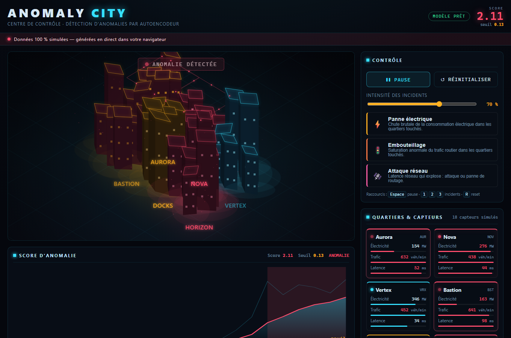

# ANOMALY CITY

> Une ville futuriste interactive qui visualise la **détection d'anomalies par Machine Learning** — entièrement dans le navigateur, sans compte, sans clé API et sans serveur.



**ANOMALY CITY** simule une ville de nuit dont les données circulent entre six quartiers : **consommation électrique**, **trafic routier** et **latence réseau**. Un **autoencodeur TensorFlow.js**, entraîné dans votre navigateur sur des données normales, détecte en direct trois incidents que vous pouvez déclencher :

| Incident | Effet simulé |
| --- | --- |
| ⚡ Panne électrique | Chute brutale de la consommation électrique |
| 🚦 Embouteillage | Saturation anormale du trafic |
| 🛰️ Attaque réseau | Explosion de la latence |

Les quartiers touchés changent d'apparence, une courbe montre l'évolution du **score d'anomalie** face au **seuil calibré**, et un journal explique ce qui a été détecté.

> ⚠️ **Toutes les données sont 100 % simulées.** Aucune donnée réelle n'est utilisée.

---

## Fonctionnalités

- **Lancer / mettre en pause / réinitialiser** la simulation.
- Déclencher chacun des trois incidents et **régler son intensité**.
- Observer la **ville isométrique animée** (canvas 2D), les **capteurs par quartier**, le **score** et le **seuil** sur une chronologie synchronisée.
- Comprendre **quel quartier et quels signaux** ont contribué à l'alerte.
- Section pédagogique **« Comment fonctionne le modèle ? »**.
- **Métriques réellement calculées** (précision, rappel, F1, taux de faux positifs) sur des séquences simulées étiquetées.
- Rendu de secours si le canvas 2D n'est pas disponible.
- Respect de la préférence **« réduire les animations »**.
- Interface **responsive** et **utilisable au clavier** (Espace, 1/2/3, R).

---

## Le modèle (autoencodeur)

Le score d'anomalie n'est **pas** une règle du type « valeur supérieure à X ». Il provient de l'**erreur de reconstruction** d'un autoencodeur :

1. Le modèle (18 → 12 → 6 → 12 → 18) n'apprend que des **journées normales**, générées de façon reproductible avec des **corrélations crédibles** entre capteurs (électricité et trafic évoluent ensemble, la latence a sa propre gigue).
2. À chaque instant, il tente de **reconstruire** les 18 capteurs. L'écart entre l'entrée et la reconstruction est le **score d'anomalie** (MSE).
3. Le **seuil** est calibré sur un **jeu de validation normal distinct** du jeu d'entraînement (99ᵉ centile des erreurs) — pas sur l'entraînement.
4. Un incident provoque des valeurs hors du « manifold normal » appris → l'erreur de reconstruction augmente → le score dépasse le seuil → **alerte**, avec remontée des capteurs qui contribuent le plus à l'erreur.

Les **métriques** (précision / rappel / F1) sont calculées en rejouant des séquences étiquetées à travers le modèle entraîné ; elles ne sont affichées que si elles ont été réellement calculées.

---

## Stack technique

- [React](https://react.dev/) + [TypeScript](https://www.typescriptlang.org/) + [Vite](https://vitejs.dev/)
- [TensorFlow.js](https://www.tensorflow.org/js) (autoencodeur, backend CPU)
- Canvas 2D isométrique « maison » (aucune dépendance graphique lourde)
- Aucun backend, aucune base de données, aucune clé.

---

## Lancer en local

Prérequis : **Node.js ≥ 20**.

```bash
npm install
npm run dev        # serveur de développement (http://localhost:5173)
```

Autres commandes :

```bash
npm run build      # type-check + build de production (dossier dist/)
npm run preview    # sert le build de production en local
npm test           # tests unitaires de la logique (vitest)
```

---

## Tests

- **Tests unitaires** (`vitest`) : reproductibilité des données, injection des incidents, calcul des métriques et du seuil.
- **Test de bout en bout** (headless) : lance la simulation, déclenche les trois scénarios, vérifie la réinitialisation et le rendu mobile (voir `scripts/e2e.mjs`).

```bash
npm test
node scripts/e2e.mjs   # nécessite un build et Edge/Chrome installé
```

---

## Déploiement sur GitHub Pages

Le dépôt est **prêt à publier**. Le build utilise `base: './'` (voir `vite.config.ts`) : les ressources se chargent correctement **aussi bien à la racine que sous `/<nom-du-depot>/`**, sans rien modifier.

1. Créez un dépôt GitHub et poussez ce dossier :

   ```bash
   git init
   git add .
   git commit -m "ANOMALY CITY"
   git branch -M main
   git remote add origin https://github.com/<vous>/<nom-du-depot>.git
   git push -u origin main
   ```

2. Sur GitHub, ouvrez **Settings → Pages** puis réglez **Source** sur **« GitHub Actions »**.

3. C'est tout : le workflow [`.github/workflows/deploy.yml`](.github/workflows/deploy.yml) se déclenche à chaque push sur `main`, construit le site et le publie sur **`https://<vous>.github.io/<nom-du-depot>/`**.

> **Dernière action à faire si vous ne voulez pas utiliser le workflow** : après un `npm run build`, le contenu du dossier `dist/` est un site statique autonome que vous pouvez héberger n'importe où (GitHub Pages, Netlify, Vercel, n'importe quel serveur statique).

---

## Structure du projet

```
anomaly-city/
├── .github/workflows/deploy.yml   # publication automatique GitHub Pages
├── public/                        # favicon + .nojekyll
├── src/
│   ├── core/                      # PRNG, types, quartiers, données, incidents
│   ├── ml/                        # autoencodeur, métriques, auto-évaluation
│   ├── sim/engine.ts              # boucle de simulation & détection
│   ├── render/cityRenderer.ts     # ville isométrique (canvas 2D)
│   ├── components/                # UI React
│   ├── hooks/                     # useSnapshot (abonnement à la simulation)
│   ├── App.tsx / main.tsx
│   └── styles.css
├── scripts/                       # serveur statique + test e2e headless
├── index.html
├── vite.config.ts
└── package.json
```

---

## Licence

Démonstration pédagogique. Libre d'utilisation et de modification.
